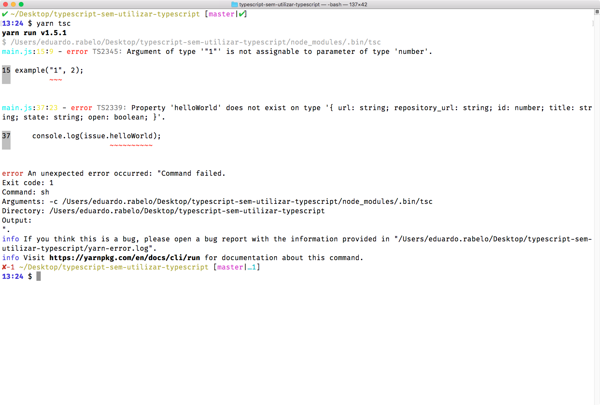

# Typescript sem utilizar TypeScript

Código example para o artigo ["TypeScript sem utilizar TypeScript"](https://medium.com/@oieduardorabelo/typescript-sem-utilizar-typescript-1323ef83b648)

- Nesse repositório, você encontrará um exemplo usando o compilador do TypeScript, `tsc`, pela linha de comando, para analisar estáticamente arquivos `.js`

- Você **não precisa** usar nenhum editor específico, é só entender como TypeScript funciona! (Qualquer dúvida, só me dar um ping no [Twitter!](https://mobile.twitter.com/oieduardorabelo))

